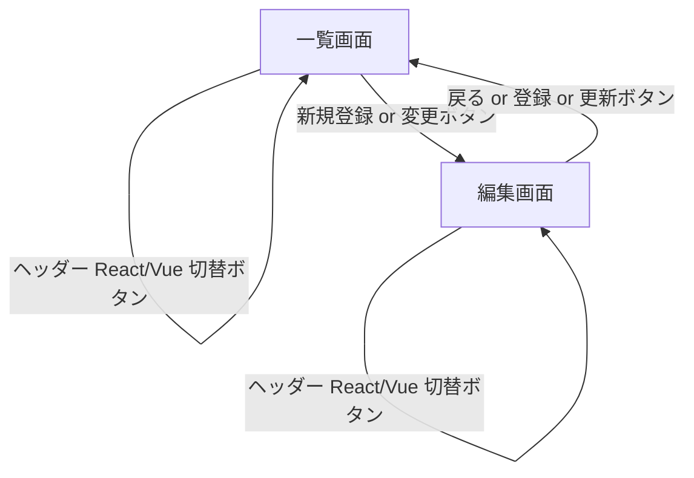

# ReactとVueの比較 | 完全に同じアプリのコードの書き方の違い
[](https://github.com/sponsors/cypher256)

# はじめに

JavaScript フロンエンドフレームワークは 2014 年ごろから本格的に使用され始め、従来のサーバーサイドテンプレートに対し、現代では一般的な Web 技術としてすっかり定着し、シェアとしては React、Vue が 2 強状態になっています。本稿では、最初に過去から現在の状況を俯瞰した後、React と Vue の関数コンポーネントを使用して、同じ画面と機能を持つコードの書き方を比較していきます。


# 過去から現在の状況


### フロントエンド MVC の衰退
10 年前、フロントエンド MVC を標榜していた Angular や Ember は低迷し、以降のフレームワークはもはや M とか V とか MV なんたらなどのレイヤーを言及しなくなり、ビュー + イベント + ステートを 1 つの責務としてまとめた直感的で分かりやすいコンポーネント指向となりました。以下は [State of JS 2021](https://2021.stateofjs.com/ja-JP/libraries/front-end-frameworks/) による関心度ランキング推移です。


### オブジェクト指向の継承や this の呪縛からの解放
コンポーネント実装方法は、以前はクラスコンポーネントでしたが、現在は関数コンポーネントへのパラダイムシフトが起こり、人類はクラスベースのオブジェクト指向の継承や this の呪縛から解放され、簡潔でバグが混入しにくい記述ができるようになりました。学習コストも低くなったので、習得するのにいい時期かと思います。


### コンパイル型高速フロントエンドの出現
現在、仮想 DOM で実行時に差分を検出してレンダリングする React と Vue が普及していますが、後発の Svelte (スヴェルト) や Solid のように仮想 DOM を使用せず、コンパイルにより事前に DOM 操作を最適化してシンプルで高速高性能 (後述のパフォーマンスの向上参照) なコンパイル型フロンエンドの出現により、新しいフレームワークの関心も高まっています。


### HTML テンプレートの進化
Svelte の構文は Vue 3.2 script setup に似て (というか Vue が Svelte に影響を受けて) いて、少ないコード量で記述できます。Solid はほぼ React ですが、再レンダリングの問題が発生しないことや、以下のように JSX の属性名も Vue のように大文字小文字を区別せず html そのままで使用できるなど、React の多くのデメリットが解消されています。Astro については後述します。

||初版|テンプレート|HTML<br>準拠|Scoped CSS<br>標準サポート|制御フロー<br>(繰り返し)|
|---|---|---|:---:|:---:|---|
|React|2013年|JSX で独自形式<br>(class → className など)|×|×|`{list.map(〜`<br>(JavaScript)|
|Vue|2014年|HTML 記述|〇|〇|`<tr v-for=`|
|Svelte|2016年|HTML 記述|〇|〇|`{#each 〜`|
|Solid|2019年|JSX だが HTML 標準|〇|×|`<For each=`|
|Astro|2021年|HTML 記述|〇|〇|`{#each 〜`|


### ビルドツールの高速化


ビルドツールの関心度ランキング。Vite (ヴィート) は Vue 作者による高速ビルドツールで React でも使用できます。2022 年 10 月には Next 開発元 Vercel により Turbopack が発表され、次回ランキング入りしそうです。


### パフォーマンスの向上
様々な指標で多くの JavaScript フレームワークが計測されている [GitHub js-framework-benchmark](https://github.com/krausest/js-framework-benchmark) による公式の総合ベンチマーク結果。DOM レンダリング、起動、メモリ確保に関して、それぞれ Vanilla JS (素の JavaScript) を 1 とした数値です。Vue のレンダリング性能は意外？にも高性能とされているコンパイラ型の Svelte とほぼ同じか少し速いようです。また React ライクな Solid ですが、JavaScript フロントエンドでトップの性能を公言しているとおり React を圧倒しています。


表示速度は UX や SEO (Google 検索順位) に大きく影響します。現在の Google クローラーは CSR (クライアント側で JavaScript を実行してレンダリング) でコンテンツを評価できるため、Next や Nuxt などの拡張フレームワークによる SSR (アクセス時にサーバー側でレンダリング) や SSG (事前に静的サイト生成) でなくてもコンテンツ自体はほとんどの場合は認識されますが、方式に関わらず表示速度はコンバージョンやエンゲージメントにとって重要です。Vercel、Cloudflare、AWS などの CDN で JS を実行するサービス CDN エッジも有用です。

**拡張フレームワークの機能**
|ベース|Astro|拡張|ファイルシステムルーティング|SSR|SSG|
|---|:---:|---|:---:|:---:|:---:|
|React|〇|Next|〇|〇|〇|
|Vue|〇|Nuxt|〇|〇|〇|
|Svelte|〇|SvelteKit|〇|〇|〇|
|Solid|〇|SolidStart|〇|〇|〇|
|Astro|←|←|〇|〇|〇|

Astro は JSX (Vue のように属性名などは HTML 標準) を使用した Astro コンポーネントが使用でき、さらに、SSR、SSG、ファイルシステムルーティングなどを含むオールインワンフレームワークですが、コンポーネント部分は好みのフロントエンドフレームワークを使用することもできます。他の拡張との違いは Astro は MPA (マルチページアプリケーション) であり、SPA の初期ロードの遅さや CSR が解消され、遅いサイトを構築することは不可能であることを目標に掲げています。さらに、デフォルトで CDN エッジにも対応しています。


### Google トレンド
世界的には React、日本では Vue も人気があり、Vue3 は大規模なアプリケーションにも対応したことにより、将来性も問題ないかと思います。Google トレンドのキーワードは "React" は普通の単語で正確な結果を得られないため、両方とも JavaScript も追加しています。


||サイト|GitHub スター数|indeed 求人数|
|---|---|---:|---:|
|React|[日本語](https://ja.reactjs.org/)|[197,000](https://github.com/facebook/react)|[51,468](https://jp.indeed.com/jobs?q=react+javascript)|
|Vue|[日本語](https://jp.vuejs.org/index.html)|(v2) [200,000](https://github.com/vuejs/vue)<br>(v3) [33,000](https://github.com/vuejs/core)|[47,820](https://jp.indeed.com/jobs?q=vue+javascript)|
|Svelte|[日本語](https://svelte.jp/)|[63,000](https://github.com/sveltejs/svelte)|[82](https://jp.indeed.com/jobs?q=svelte+javascript)|
|Solid|[日本語](https://www.solidjs.com/)|[23,000](https://github.com/solidjs/solid)|[166](https://jp.indeed.com/jobs?q=solid+javascript)|
|Astro|[日本語](https://docs.astro.build/ja/getting-started/)|[22,000](https://github.com/withastro/astro)|[4](https://jp.indeed.com/jobs?q=astro+javascript)|

先日バズってたデジタル庁の募集要項にも、必須スキルとして React と Vue の記載がありましたね。

> 必須スキル
> * フロントエンドアプリケーション技術の知識と開発経験
> * TypeScriptを使った実装経験
> * ReactやVue.jsを用いたフロントエンドの実装経験

https://herp.careers/v1/digitalsaiyo/dEGBwpG2nBJ9


<!-- ============================================================ -->
# React と Vue のコード比較


### サンプルの概要
* React と Vue で同じ画面を実装。
* CRUD (登録、検索、更新、削除) の SPA (シングルページアプリケーション)。
* npm なしで、CDN を使用してブラウザ (と API サーバー) のみで動作。
* サーバー、フロントエンド双方非依存で差し替え可能となるように、言語固有のサーバーサイドテンプレートエンジンを使用せず、純粋な HTML と REST API 通信のみを想定。サーバーサイドの言語・技術は不問。


### 対象者
* npm とか使わずにチョット動かして、React と Vue 完全に理解したって言いたい
* Blade、ERB、JSP、Thymeleaf とかのサーバーサイドテンプレート知ってる
* JavaScript は昔の書き方なら知ってる
* React、Vue どちらかだけ少し知ってる


### 画面イメージ
サンプルコードは固有のコンポーネントライブラリ **[^ui_lib]** を使用していないため、見た目や動作の違いはありません。一覧画面でも編集画面でも、ヘッダーの `React` `Vue` をクリックすることでフロントエンドフレームワークを相互遷移できます。

[^ui_lib]:本記事では使用していませんが、github スター数が多いコンポーネントライブラリとしては、React の Material UI や Vue の Vuetify など Google のマテリアルデザインに基づいたものが有名です。

<table>
<tr>
<td>
<b>React</b>
</td>
<td>
<b>Vue</b>
</td>
</tr>
<tr>
<td>

一覧

編集


</td>
<td>

一覧

編集


</td>
</tr>
</table>



### 通信ライブラリ
通信ライブラリは、多くのフロンエンドで利用されデファクトスタンダードになっている axios を使用しています。axios はリクエスト内容に応じた `content-type` や CSRF Cookie が存在する場合の `X-XSRF-TOKEN` など、色々と自動でリクエストヘッダーをセットしてくれます。また、JavaScript 標準の `URLSearchParams` と `FormData` を使用することで、簡単にフォームの内容をすべてまとめて、普通の html form サブミットと同じ形式 `application/form-url-encoded` として post したり、+ 連結で toString して get 送信することができます。ちなみに HTML で id を設定した要素は `document.getElementById('id名')` とかしなくても、下記のように id を変数名として直接 HTML 要素を参照できます。**[^html_id]**

[^html_id]:html の各要素の id は window のプロパティとしてグローバル変数になるため注意する必要がありますが、window オブジェクトが元から持つプロパティが上書きされることはありません。

```javascript
// HTML form 要素からパラメータ作成 <form id="id_form" ...>
const formParams = new URLSearchParams(new FormData(id_form));
// post 送信は第 2 引数に渡す
const { data } = await axios.post('register', formParams);
// get 送信は URL に文字列連結 (key1=value1&key2=value2 のような形に展開される)
const { data } = await axios.get('search?' + formParams);
```

通信などの非同期処理は、以前は `Promise` と `then` を使用した面倒なコールバックが必要でしたが、ES2017 から `Promise` は多くの言語でも採用されている [async/await 構文 (MDN↗)](https://developer.mozilla.org/ja/docs/Web/JavaScript/Reference/Statements/async_function)としてサポートされるようになり、自然な流れで記述できる **[^promise]** ようになりました。上記の例の `{ data }` は、ES2015 からの [分割代入 (MDN↗)](https://developer.mozilla.org/ja/docs/Web/JavaScript/Reference/Operators/Destructuring_assignment#%E3%82%AA%E3%83%96%E3%82%B8%E3%82%A7%E3%82%AF%E3%83%88%E3%81%AE%E5%88%86%E5%89%B2%E4%BB%A3%E5%85%A5) で、axios 結果オブジェクトの data プロパティ (HTTP レスポンスボディ) を代入しています。代入先には `{ data, status }` のように結果オブジェクトの名前が一致する複数のプロパティ名を指定することができます。

[^promise]:複数の処理を非同期で実行して結果を待つ場合は、Promise.all や allSettled などを使用する必要があります。

なお、axios はインターセプターで共通処理を記述できるようになっています。axios はデフォルトでは HTTP ステータスが 2xx 以外の場合、エラー扱いとなります。本稿では、以下のように、すべての通信で同じ共通エラー処理を行うインターセプターを定義しています。バッククォートで囲まれた文字は、ES2015 から使用可能になった変数埋め込みが可能な [テンプレートリテラル (MDN↗)](https://developer.mozilla.org/ja/docs/Web/JavaScript/Reference/Template_literals) です。ドットチェーン `error.config?.url` の `?.` は ES2020 から使用できる [オプショナルチェーン演算子 (MDN↗)](https://developer.mozilla.org/ja/docs/Web/JavaScript/Reference/Operators/Optional_chaining) で、親オブジェクトが null や undefined でもエラーにならずに undefined を返します。

```javascript:axios-common-interceptor.js
axios.interceptors.response.use(
	res => res,
	error => {
		id_message.textContent = (error.response?.status == 401)
			? `❌ セッションが切れました。ページを更新してください。`
			: `❌ 処理できませんでした。 [${error.message}] ${error.config?.url}`;
		return Promise.reject(error);
	}
);

const params = htmlForm => new URLSearchParams(new FormData(htmlForm));
// ↑ axios.post('register', params(id_form)) のように使う
```

ついでに、form 要素から `URLSearchParams` を作成するための params 関数も定義しています。


### ファイル構成
1 つの HTML と、複数のコンポーネントから構成され、コンポーネントファイルの拡張子は React は .jsx、Vue は .vue です。通常、コンポーネントは細分化し再利用可能なように設計します。サンプルでは画面遷移に相当するページ単位のコンポーネントでのみ構成し、HTML もコンポーネントも同じディレクトリに配置しています。次項では、このファイル単位でコードの違いを見ていきます。

||React|Vue|
|---|---|---|
|HTML|react.html|vue.html|
|一覧コンポーネント|ReactList.jsx|VueList.vue|
|編集コンポーネント|ReactEdit.jsx|VueEdit.vue|


<!-- ============================================================ -->
### コード比較： HTML シングルページ
サンプルコードの React、Vue とも、HTML 部分はヘッダーとフッターのみで構成され、下記イメージの緑線で囲まれたメイン部分のコンポーネントが切り替わります。一般的に SPA では、この切り替えるコンポーネントと `path` の組み合わせをルーターとして定義します。デフォルトでは `path` '/' で定義したコンポーネントが最初に表示されます。


React、Vue ともブラウザルーターとハッシュルーターがあり、両方とも画面遷移でブラウザ上の URL が切り替わりますが、ページ読み込みは発生しません。ここでは、サーバー側のマッピングを省略するため、このサンプルでは React、Vue ともハッシュルーターを使用しています。

> **:information_source: JavaScript の History API を使用したブラウザルーター**
ブラウザの URL が `/aaa/edit/1` のように変わるため見た目が普通で分かりやすい。リロードやブックマークされたときのために、違う URL でもサーバー側で同じ HTML を返すようにマッピングが必要。通常はこちらを使用する。

> **:information_source: URL ハッシュを使用したハッシュルーター**
URL 末尾に `/aaa/x.html#/edit/1` などを付加してページ制御。History API 登場以前からある方法。ハッシュ以降の文字列はサーバーに送信されないため、サーバー側のマッピング不要。

下表の (*1) は、事前トランスパイルせずにブラウザで直接実行するために必要な構成です。なお、ES2015 からライブラリが [ES Modules (MDN↗)](https://developer.mozilla.org/ja/docs/Web/JavaScript/Guide/Modules) に対応していれば、ブラウザでも export、import が使用できます。**[^module]**

[^module]:ES2015 からブラウザ上の JavaScipt で `import { xxx } from "./xxx.js";` や `<script type="module" src="xxx.js"></script>` とすることでモジュールが使用できます。babel も適用する場合は、`<script type="text/babel" data-type="module" src="xxx.js"></script>` のように data-type を指定します。

https://postd.cc/modern-web-apps-without-javascript-bundling-or-transpiling/

||React|Vue|
|---|---|---|
|バージョン|18|3.2|
|トランスパイラ (*1)|JSX **[^jsx]** をトランスパイルするための babel/standalone を CDN から読み込み|SFC （単一ファイルコンポーネント） .vue ファイルを解釈するための vue3-sfc-loader を CDN から読み込み|
|トランスパイル (*1)|script タグに "text/babel" を指定<br>`<script type="text/babel" src="xxx.jsx"></script>`|vue3-sfc-loader の関数で .vue ファイル読み込み|
|ルーター|サードパーティライブラリ<br>React Router<br>(Next のルーターは別もの)|Vue コアライブラリ<br>Vue Router<br>(Nuxt のルーターはこれ)|
|ルーター遷移時の動作指定|該当機能なし|ナビゲーションガード beforeEach で遷移前処理|
|操作|ReactDOM.createRoot<br>React.useState<br>React.useEffect|Vue.createApp<br>Vue.ref<br>Vue.onMounted|

[^jsx]: JSX は JavaScript 内に直接 HTML を記述できるものですが、React 固有ものではなく Vue でも使用可能で、Nuxt.js では設定なしで使用可能です。


```html:react.html
<!DOCTYPE html>
<html>
<head>
<meta name="viewport" content="width=device-width">
<link rel="stylesheet" href="https://cdn.jsdelivr.net/npm/bootstrap@5/dist/css/bootstrap.min.css">
<title>React の場合</title>
</head>
<body class="bg-dark bg-gradient text-light vh-100">
<!-- : ヘッダー省略 -->
<!-- ========== メイン (React Router 画面遷移部分) ========== -->
<div class="container">
	<div class="alert mb-0" id="id_message" style="min-height:4rem"></div>
	<div id="id_root"><!-- コンポーネント表示部 -->
		<div class="d-flex justify-content-center">
			<div class="spinner-border text-secondary"></div><!-- ロード画像 (レンダー時に消去される) -->
		</div>
	</div>
</div>
<!-- : フッター省略 -->
</body>
<script src="https://cdn.jsdelivr.net/npm/bootstrap@5/dist/js/bootstrap.bundle.min.js"></script>
<script src="https://cdn.jsdelivr.net/npm/react@18/umd/react.development.js"></script>
<script src="https://cdn.jsdelivr.net/npm/react-dom@18/umd/react-dom.development.js"></script>
<script src="https://cdn.jsdelivr.net/npm/react-router-dom@5/umd/react-router-dom.min.js"></script>
<script src="https://cdn.jsdelivr.net/npm/axios@1/dist/axios.min.js"></script>
<script src="../static/axios-common-interceptor.js"></script>

<!-- npm を使用せず CDN で JSX を使えるように babel を組み込み、.jsx を text/babel でロード -->
<script src="https://cdn.jsdelivr.net/npm/@babel/standalone@7/babel.min.js"></script>
<script type="text/babel" src="ReactEdit.jsx"></script>
<script type="text/babel" src="ReactList.jsx"></script>
<script>

// React を操作するための関数
const { useState, useEffect, createContext } = React;
const { HashRouter, Route, Link, useParams, useHistory } = ReactRouterDOM; // v5 (v6 は CDN 未対応)
</script>
<!-- React Router 定義 (ハッシュルーター使用) -->
<script type="text/babel">
const App = () => {
	return (
		<HashRouter>
			<Route path="/" exact   component={ReactList} />
			<Route path="/edit/:id" component={ReactEdit} />
		</HashRouter>
	);
};
ReactDOM.createRoot(id_root).render(<App />); // React 18 以降は createRoot 推奨
</script>
</html>
```

```html:vue.html
<!DOCTYPE html>
<html>
<head>
<meta name="viewport" content="width=device-width">
<link rel="stylesheet" href="https://cdn.jsdelivr.net/npm/bootstrap@5/dist/css/bootstrap.min.css">
<title>Vue の場合</title>
</head>
<body class="bg-dark bg-gradient text-light vh-100">
<!-- : ヘッダー省略 -->
<!-- ========== メイン (Vue Router 画面遷移部分) ========== -->
<div class="container">
	<div class="alert mb-0" id="id_message" style="min-height:4rem"></div>
	<div class="d-flex justify-content-center" id="id_loading">
		<div class="spinner-border text-secondary"></div><!-- ロード画像 (ナビゲーションガードで消去) -->
	</div>
	<div id="id_app"><router-view></div><!-- コンポーネント表示部 -->
</div>
<!-- : フッター省略 -->
</body>
<script src="https://cdn.jsdelivr.net/npm/bootstrap@5/dist/js/bootstrap.bundle.min.js"></script>
<script src="https://cdn.jsdelivr.net/npm/vue@3"></script>
<script src="https://cdn.jsdelivr.net/npm/vue-router@4"></script>
<script src="https://cdn.jsdelivr.net/npm/vue3-sfc-loader"></script>
<script src="https://cdn.jsdelivr.net/npm/axios@1/dist/axios.min.js"></script>
<script src="../static/axios-common-interceptor.js"></script>
<script>
// npm を使用せず CDN で Vue SFC (単一ファイルコンポーネント .vue ファイル) を使えるようにする
const loadVueFile = path => {return window["vue3-sfc-loader"].loadModule(path, {
	moduleCache: {vue: Vue,},
	async getFile(url) {return (await fetch(url)).text()},
	addStyle(textContent) {
		const style = Object.assign(document.createElement('style'), {textContent,});
		const ref = document.head.getElementsByTagName('style')[0] || null;
		document.head.insertBefore(style, ref);
	},
})};

// Vue を操作するための関数
const { createApp, ref, reactive, onMounted } = Vue;
const { createRouter, createWebHashHistory, useRoute, useRouter } = VueRouter;

// Vue Router 定義 (ハッシュルーター使用)
const router = createRouter({
	history: createWebHashHistory(),
	routes: [
		{ path: "/",         component: () => loadVueFile('./VueList.vue') },
		{ path: "/edit/:id", component: () => loadVueFile('./VueEdit.vue') },
	],
});
router.beforeEach((to, from, next) => {
	id_loading.classList.add('d-none'); // Vue ナビゲーションガードでロード画像消去 (直接 edit が呼ばれたときにも対応)
	next();
});
createApp({}).use(router).mount(id_app);
</script>
</html>
```


<!-- ============================================================ -->
### コード比較： 一覧コンポーネント


コンポーネント仕様
* 検索条件を変更するたびに、件数取得 API を呼び出し、結果予定件数をメッセージ表示。
* 検索ボタンを押すと、検索 API を呼び出し、一覧の差分のみを表示更新（仮想 DOM）。

Vue 3.2 で Composition API の糖衣構文 `<script setup>` が使えるようになって、React の関数コンポーネントと見た目がそんなに変わらなくなりましたが、以下のような細かい違いがあります。

**構造と JavaScript 部分の違い**
||React|Vue|
|---|---|---|
|コンポーネントファイル名の命名規則|PascalCase<br>例 `ListPage.jsx`|PascalCase または kebab-case<br>例 `ListPage.vue`|
|コンポーネント構造|`const ListPage = () => {`<br>　　状態、関数、初期処理<br>`　　return (`<br>　　　　JSX テンプレート<br>`　　);`<br>`}`|`<script setup>`<br>　　状態、関数、初期処理<br>`</script>`<br>`<template>`<br>　　HTML テンプレート<br>`</template>`|
|状態の宣言|`const [itemList, setItemList] = useState([])`|`const itemList = ref([])`|
|状態の更新 (表示更新)|上記宣言の setter を呼び出す<br>`setItemList(data)`|上記宣言の .value にセット<br>`itemList.value = data`|
|初期処理|`useEffect(() => {初期処理}, [])`|`onMounted(() => {初期処理})`|

**テンプレート部分の違い**
||React|Vue|
|---|---|---|
|形式|JSX (HTML 風だが大文字小文字を間違うとエラー)|`<template>` タグ内に HTML を記述|
|html 属性名|camelCase (html と異なる)<br>❌ onclick、class<br>🟢 onClick、className|HTML そのまま<br>(大文字小文字区別なし)|
|style 属性名|camelCase (html と異なる)<br>❌ background-image<br>🟢 backgroundImage|HTML そのまま<br>(大文字小文字区別なし)|
|変数の出力|`{item.name}`|`{{item.name}}`|
|式|`<tr className={itemList.length == 0 ? 'd-none' : ''}>`|`<tr class="{{itemList.length == 0 ? 'd-none' : ''}}">`|
|繰り返し|JSX 内に JavaScript で記述<br>`{itemList.map(item => (`<br>`　　<tr key={item.id}>`<br>`　　　　<td>{item.name}</td>`<br>`　　</tr>`<br>`))}`|HTML タグに Vue 属性を記述<br>`<tr v-for="item in itemList">`<br>`　　<td>{{item.name}}</td>`<br>`</tr>`|
|html oninput|`<input onInput={handleChange}`|`<input @input="handleChange"`<br>`@` は `v-on` の短縮形|
|html onchange|なし。onChange を指定しても oninput になってしまう。|`<input @change="handleChange"`|
|html onclick|`<button onClick={() => handleDelete(item.id)}`|`<button @click="() => handleDelete(item.id)"`|
|html onsubmit|`<form onSubmit={handleSubmit}`<br>e.preventDefault() 呼び出しが必要|`<form @submit.prevent="handleSubmit"`<br>.prevent は e.preventDefault() と同じ効果|
|データバインディング|単方向 (value 指定したものを制御コンポートと呼び、onChange も設定しないと変更できなくなる。初期値設定のみの defaultValue 指定したものは非制御コンポーネントと呼ぶ。)|単方向は `:value` (`:` は `v-bind:` の短縮形)、双方向は `v-model`|
|ルーターリンク|`<Link to={'/edit/' + item.id}`|`<router-link :to="'/edit/' + item.id"`|

コード中の `??` は ES2020 から追加された [Null 合体演算子 (MDN↗)](https://developer.mozilla.org/ja/docs/Web/JavaScript/Reference/Operators/Nullish_coalescing) で、さらに `=` と組み合わせた `??=` は [Null 合体代入 (MDN↗)](https://developer.mozilla.org/ja/docs/Web/JavaScript/Reference/Operators/Nullish_coalescing_assignment) といい、左辺が null または undefined の場合だけ代入を行います。よく似た論理和演算子 `||` や `||=` は左辺が 0 や "" (falsy な値) でも短絡するところが異なります。

```jsx:ReactList.jsx
/* React 一覧コンポーネント */
const ReactList = () => {
   
	const savedForm = window._ReactSearchForm ??= {name:'', releaseDate:''}; // 一覧戻り時表示用の条件保存 (null 合体代入)
	const [itemList, setItemList] = useState([]); // ステートフックで jsx で使用する値を定義 (set は setter を使う)
	useEffect(() => {handleSearch()}, []); // レンダー後の処理 (第2引数は検知対象で空配列の場合はこのコンポーネント本体のみ)

	// 検索 API 呼び出し   
	const handleSearch = async() => {
		const { data } = await axios.get('search?' + params(id_form));
		typeof data === 'string' ? id_message.textContent = data : setItemList(data);
  	};
  	
  	// 検索ボタンクリック、フォーム Enter → 検索 API 呼び出し
	const handleSubmit = async(e) => {
		e.preventDefault(); // デフォルトサブミット抑止
		id_message.textContent = null;
		handleSearch();
  	};
    // : その他 JavaScript 省略
  	
	return (
<HashRouter>
	<form onSubmit={handleSubmit} id="id_form" method="get" className="d-sm-flex flex-wrap align-items-end">
		<label className="form-label me-sm-3">製品名</label>
		<div className="me-sm-4">
			<input className="form-control" type="search" name="name" autoFocus 
				onInput={handleChange} defaultValue={savedForm.name}/>
		</div>
        {/* : 他の検索項目省略 */}
		<button type="submit" className="btn btn-secondary px-5">検索</button>
		<Link to="/edit/0" className="btn btn-secondary px-5 ms-auto">新規登録</Link>
	</form>
	<table className="table table-striped table-dark">
		{/* : テーブルヘッダ省略 */}
		<tbody>
	： React のループ処理 (検索結果一覧)
	{itemList.map(item => (
			<tr key={item.id}>
				<td>{item.name}</td>
                {/* : 他の列省略 */}
				<td className="text-center">
					<Link to={'/edit/' + item.id} className="btn btn-secondary me-1">変更</Link>
					<button type="button" onClick={() => handleDelete(item.id)} className="btn btn-warning">削除</button>
				</td>
			</tr>
	))}
		</tbody>
	</table>
</HashRouter>
	);
}
```

```vue:VueList.vue
<!-- Vue 一覧コンポーネント (script setup は Vue 3.2 以降) -->
<script setup>

	const savedForm = window._VueSearchForm ??= {name:'', releaseDate:''}; // 一覧戻り時表示用の条件保存 (null 合体代入)
	const itemList = ref([]); // ref で template で使用する値を定義 (コードでは .value でアクセス)
	onMounted(() => handleSearch()); // コンポーネントのマウント時の処理 

	// 検索 API 呼び出し   
	const handleSearch = async() => {
		const { data } = await axios.get('search?' + params(id_form));
		typeof data === 'string' ? id_message.textContent = data : itemList.value = data;
  	};
  	
  	// 検索ボタンクリック、フォーム Enter → 検索 API 呼び出し
	const handleSubmit = async(e) => {
		// @submit.prevent しているため e.preventDefault() 不要
		id_message.textContent = null;
		handleSearch();
  	};
    // : その他 JavaScript 省略
</script>
<template>
	<form @submit.prevent="handleSubmit" id="id_form" method="get" class="d-sm-flex flex-wrap align-items-end">
		<label class="form-label me-sm-3">製品名</label>
		<div class="me-sm-4">
			<input class="form-control" type="search" name="name" autofocus
				@input="handleChange" :value="savedForm.name">
		</div>
        <!-- : 他の検索項目省略 -->
		<button type="submit" class="btn btn-secondary px-5">検索</button>
		<router-link to="/edit/0" class="btn btn-secondary px-5 ms-auto">新規登録</router-link>
	</form>
	<p class="text-end mt-4 me-1 mb-2">検索結果 {{itemList.length}} 件</p>
	<table class="table table-striped table-dark">
		<!-- : テーブルヘッダ省略 -->
		<tbody>
			： Vue のループ処理 (検索結果一覧)
			<tr v-for="item in itemList">
				<td>{{item.name}}</td>
                <!-- : 他の列省略 -->
				<td class="text-center">
					<router-link :to="'/edit/' + item.id" class="btn btn-secondary me-1">変更</router-link>
					<button type="button" @click="() => handleDelete(item.id)" class="btn btn-warning">削除</button>
				</td>
			</tr>
		</tbody>
	</table>
</template>
```


<!-- ============================================================ -->
### コード比較： 編集コンポーネント


コンポーネント仕様
* フォームの値を変更するたびに、入力チェック API を呼び出し、エラーメッセージを表示。
* クライアント側に入力チェックロジックなし。

こちらも、コードはだいたい同じですが、細かい違いがあります。

||React|Vue|
|---|---|---|
|ルーターの取得|`const router = useHistory()`|`const router = useRouter()`|
|一覧コンポーネントに遷移|`router.push('/')`<br>(履歴上書きは `replace`)|同左|
|遷移元からのパラメータ取得|`const id = useParams().id`|`const id = useRoute().params.id`|
|普通の html イベント|使用不可<br>❌ `onfocus="this.処理"`<br>🟢 `onFocus={e => 処理}`|使用可能<br>🟢 `onfocus="this.処理"`<br>🟢 `@focus="e => 処理"`|
|select タグの初期選択|select タグに value (onChange を設定しないと変更できなくなる)|option タグに `:selected="item.companyId == com.id"`|

React コード中の `setItem({...item, companyId: e.target.value})` の `...` は ES2018 からの [スプレッド構文 (MDN↗)](https://developer.mozilla.org/ja/docs/Web/JavaScript/Reference/Operators/Spread_syntax) で、item が持つプロパティを展開し、companyId をセットして、新しいオブジェクトを生成しなおして setItem しています。

```jsx:ReactEdit.jsx
/* React 編集コンポーネント */
const ReactEdit = () => {
	
	const router = useHistory(); // React Router v5 (v6 では useNavigate)
	const id = useParams().id; // 遷移時に渡されたパラメーター
	const isInsert = id == 0;
	const [item, setItem] = useState({});
	const [companySelect, setCompanySelect] = useState([]);
	useEffect(() => {handleInit()}, []);

	// 初期表示 → 取得 API 呼び出し   
	const handleInit = async() => {
		id_message.textContent = null;
		if (!isInsert) {
			const { data } = await axios.get('select?id=' + id);
			if (typeof data === 'string') {
				id_message.textContent = data; // エラーメッセージ String
				router.push('/');
				return;
			} else {
				setItem(data); // ItemForm json
			}
		}
		setCompanySelect((await axios.get('select-company')).data);
		id_name.focus(); // jsx での autoFocus={true} だと初期値セットで onFocus が動作しないため
  	};
    // : その他 JavaScript 省略

	return (
<HashRouter>
	<form onSubmit={handleSubmit} id="id_form" method="post">
		<input type="hidden" name="id" defaultValue={item.id}/>
		<div className="mb-3">
			<label className="form-label">製品名</label> <span className="badge bg-danger">必須</span>
			<input className="form-control" type="text" name="name" defaultValue={item.name} id="id_name"
				onFocus={e => e.target.setSelectionRange(99,99)}
				onInput={handleChange} required/>
		</div>
		{/* : 他の入力項目省略 */}
		<div className="mb-5">
			<label className="form-label">メーカー</label>
			{/* select は制御コンポーネントでないと警告が出るため value と onInput 使用 (... はスプレッド構文) */}
			<select name="companyId" className="form-select w-auto" value={item.companyId}
				onInput={e => setItem({...item, companyId: e.target.value})}>
		: React ループ処理 (select 選択肢)
		{companySelect.map(com => (
				<option key={com.id} value={com.id}>{com.companyName}</option>
		))}
			</select>
		</div>
		<Link to="/" className="btn btn-secondary px-5 me-1">戻る</Link>
		<input id="id_submit_button" type="submit" className="btn btn-warning px-5" value={isInsert ? '登録' : '更新'}/>
	</form>
</HashRouter>
	);
}
```

```vue:VueEdit.vue
<!-- Vue 編集コンポーネント -->
<script setup>

	const router = useRouter(); // Vue Router
	const id = useRoute().params.id; // 遷移時に渡されたパラメーター
	const isInsert = id == 0;
	const item = ref({});
	const companySelect = ref([]);
	onMounted(() => {handleInit()});

	// 初期表示 → 取得 API 呼び出し   
	const handleInit = async() => {
		id_message.textContent = null;
		if (!isInsert) {
			const { data } = await axios.get('select?id=' + id);
			if (typeof data === 'string') {
				id_message.textContent = data; // エラーメッセージ String
				router.push('/');
				return;
			} else {
				item.value = data; // ItemForm json
			}
		}
		companySelect.value = (await axios.get('select-company')).data;
		id_name.focus(); // テンプレートでの autofocus だと初期値セットで onfocus が動作しないため
  	};
    // : その他 JavaScript 省略
</script>
<template>
	<form @submit.prevent="handleSubmit" id="id_form" method="post">
		<input type="hidden" name="id" :value="item.id"/>
		<div class="mb-3">
			<label class="form-label">製品名</label> <span class="badge bg-danger">必須</span>
			<input class="form-control" type="text" name="name" required id="id_name" :value="item.name"
				onfocus="this.setSelectionRange(99,99)"
				@input="handleChange">
		</div>
		<!-- : 他の入力項目省略 -->
		<div class="mb-5">
			<label class="form-label">メーカー</label>
			<select name="companyId" class="form-select w-auto">
				: Vue ループ処理 (select 選択肢)
				<option v-for="com in companySelect" :value="com.id" :selected="item.companyId == com.id"
					>{{com.companyName}}</option>
			</select>
		</div>
		<router-link to="/" class="btn btn-secondary px-5 me-1">戻る</router-link>
		<input id="id_submit_button" type="submit" class="btn btn-warning px-5" :value="isInsert ? '登録' : '更新'"/>
	</form>
</template>
```


### 動かしてみよう
このリポジトリからコードを取得し、1 つの Gradle プロジェクト **[^gradle_project]** として、好みの IDE やコマンドラインから動かすことができます。
以下に Eclipse にインポートした場合の起動方法を示します。

[^gradle_project]: 本来は、サーバーとフロントエンドを完全に別のプロジェクトとして分離したほうが、ロジックもテクノロジーも依存性が低くなり、保守性が高くなります。

#### プロジェクト取得
* メニュー > ファイル > インポート > Git からプロジェクト > クローン URI > URI 貼り付け > 次へ > 次へ > 次へ > 一般的なプロジェクトとしてインポート > 次へ > プロジェクト名を入力 > 完了
* プロジェクト右クリック > 構成 > Gradle ネーチャーの追加

#### プロジェクト実行
* プロジェクト右クリック > デバッグ > サーバーでデバッグ
		(実行ではなくデバッグ実行することで、再起動なしで Java コードの変更が反映される)
		> サーバー > ツリーの localhost 開く > Tomcat10_Java17
		> このプロジェクトを実行するときは常にこのサーバーを使用 ON
		> 完了
